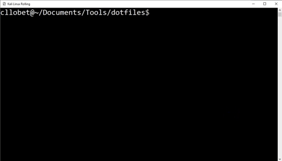

# dotfiles
Environment configuration Run&Go

This project aims to avoid cumbersome configurations when working in a new environment.



<a href="https://www.buymeacoffee.com/carlesllobet" target="_blank"></a>

## Getting Started

These instructions will get you a copy of the environment configuration up and running on your local machine. 

### Installation

```
git clone https://github.com/CarlesLlobet/dotfiles.git
```

### Usage

To apply this configurations you'll just need one of the following systems: 
- MacOSX (Still under construction, not tested)
- Linux

You can configure the basic profile by executing:

```
sudo setup.sh
```

Select specific profiles or silent mode with parameters:

```
Usage: setup.sh [-h | --help] [-y | --yes] [-p | --profile <profile>]
        Profiles:
            [b | basic] (default)
            [f | full]
            [d | developer]
            [p | pentester]
            [s | server]
            
```

### Customization

To customize this dotfiles with your own tools, you just have to add/remove APT packages in the packagelists of each profile, and/or copy installscripts for manual installation/building of tools into the proper installscripts profile folder.

## Out of the Box Software

### OSX

#### Setup Packages
This specific package is always installed in Linux (if not in Kali distribution) from the setup script in order to add repositories easily.

* [software-properties-common](https://packages.debian.org/sid/admin/software-properties-common) (APT) - Useful to add and remove PPAs (repositories) to apt

#### Basic
Basic packages needed in any environment.

* [android-platform-tools](https://developer.android.com/tools/releases/platform-tools?hl=es-419) (Brew) - To have ADB
* [bash](https://www.gnu.org/software/bash/) (Brew) - The GNU Project's shell—the Bourne Again SHell
* [bash-completion](https://github.com/scop/bash-completion) (Brew) - a collection of command line command completions for the Bash shell
* [curl](https://curl.haxx.se/) (Brew) - To make requests from command line
* [Docker](https://www.docker.com/) (Brew) - Application virtualization software
* [flameshot](https://flameshot.org/) (Brew) - Powerful, yet simple to use open-source screenshot software.
* [iterm2](https://iterm2.com/) (Brew) - Terminal Emulator for macOS that does amazing things
* [gnupg2](https://gnupg.org/) (Brew) - OpenPGP implementation to cypher and decypher
* [htop](https://linux.die.net/man/1/htop) (Brew) - Interactive Process Viewer
* [pandoc](https://pandoc.org/) (Brew) - Converting Markup files to other formats (docx, ppt, etc.)
* [python3-pip](https://pypi.org/project/pip/) (Brew) - Package Installer for Python
* [ranger](https://github.com/ranger/ranger) (Brew) - Filemanager from Console, inspired in Vim
* [thefuck](https://github.com/nvbn/thefuck) (Brew) - Command line Typo Autocorrector
* [tiles](https://www.sempliva.com/tiles/) (Brew) - The window manager for macOS
* [tmux](https://github.com/tmux/tmux/wiki) (Brew) - Terminal Multiplexer
* [vim](https://www.vim.org/) (Brew) - The Text Editor
* [xclip](https://linux.die.net/man/1/xclip) (Brew) - Copy/Paste from Command line

#### Developer
Specific packages for developers.

* [autoconf](https://www.gnu.org/software/autoconf/) (Brew) - Required by automake (below)
* [automake](https://www.gnu.org/software/automake/) (Brew) - To generate Makefiles regardless of the environment (Linux dist, installed packages,...)
* [cscope](http://cscope.sourceforge.net/) (Brew) - Browse C Source Code (even C++ and Java)
* [ctags](http://ctags.sourceforge.net/) (Brew) - Multilanguage implementation of Ctags to identify functions
* [libc6-dev](https://packages.debian.org/jessie/libc6-dev) (Brew) - GNU C development library
 
#### Pentester
Specific packages for cybersecurity engineers.

* [assetfinder](https://github.com/tomnomnom/assetfinder) (Go) - Find domains and subdomains potentially related to a given domain
* [binwalk](https://github.com/ReFirmLabs/binwalk) (Brew) - RE tool to analyze and extract firmware images
* [cherrytree](https://www.giuspen.net/cherrytree/) (Brew) - A hierarchical note taking application
* [cscope](http://cscope.sourceforge.net/) (APT) - Browse C Source Code (even C++ and Java)
* [dalfox](https://github.com/hahwul/dalfox) (Go) - A powerful open-source XSS scanner
* [dnsx](https://github.com/projectdiscovery/dnsx) (Go) - A fast and multi-purpose DNS toolkit designed for running DNS queries
* [feroxbuster](https://github.com/epi052/feroxbuster) (Brew) - A simple, fast, recursive content discovery tool written in Rust
* [ffuf](https://github.com/ffuf/ffuf) (Go) - A fast web fuzzer written in Go
* [getallurls](https://github.com/lc/gau) (Go) -  fetches known URLs from AlienVault's Open Threat Exchange, the Wayback Machine, Common Crawl, and URLScan for any given domain
* [gobuster](https://github.com/OJ/gobuster) (Go) - Gobuster is a tool used to brute-force URIs, DNS subdomains, Virtual Host names, S3 buckets, and many more
* [hakrawler](https://github.com/hakluke/hakrawler) (Go) - Fast golang web crawler for gathering URLs and JavaScript file locations
* [kxss](github.com/Emoe/kxss) (Go) - Checks URL params for returned data to look for XSS
* [nmap](https://nmap.org/) (Brew) - Network Discovery Scanner
* [nuclei](https://github.com/projectdiscovery/nuclei) (Go) - Fast and customizable vulnerability scanner based on YAML templates
* [shuffledns](https://github.com/projectdiscovery/shuffledns) (Go) - wrapper around massdns to enumerate valid subdomains using active bruteforce
* [subjack](https://github.com/haccer/subjack) (Go) - Subdomain Takeover tool
* [SynackAPI](https://github.com/bamhm182/SynackAPI) (Pip) - A Python Library designed to facilitate interaction with Synack's undocumented API endpoints
* [qemu](https://www.qemu.org/) (Brew) - Virtual Machine Manager
* [virt-manager](https://virt-manager.org/) (Brew) - Desktop GUI to manage VMs
* [virt-viewer](https://pagure.io/virt-viewer) (Brew) - Desktop GUI to view VM guests
* [waybackurls](https://github.com/tomnomnom/waybackurls) (Go) - Fetch all the URLs that the Wayback Machine knows about for a domain
* [whireshark](https://www.wireshark.org/) (Brew) - Network protocol analyzer

#### Server
Specific packages for servers.

* [net-tools](http://net-tools.sourceforge.net/) (Brew) - Collection of network utilities for Linux

#### Full
All of the packets from profiles mentioned above.

### Linux

#### Setup Packages
This specific package is always installed in Linux (if not in Kali distribution) from the setup script in order to add repositories easily.

* [software-properties-common](https://packages.debian.org/sid/admin/software-properties-common) (APT) - Useful to add and remove PPAs (repositories) to apt

#### Basic
Basic packages needed in any environment.

* [apt-transport-https](https://manpages.ubuntu.com/manpages/bionic/man1/apt-transport-https.1.html) (APT) - To download from APT via HTTPS
* [bash](https://www.gnu.org/software/bash/) (APT) - The GNU Project's shell—the Bourne Again SHell
* [bash-completion](https://github.com/scop/bash-completion) (APT) - a collection of command line command completions for the Bash shell
* [build-essential](https://packages.debian.org/es/sid/build-essential) (APT) - C and C++ compilers, with libc and dpkg-dev, make, etc.
* [ca-certificates](https://packages.debian.org/sid/ca-certificates) (APT) - To use CA Certificates
* [curl](https://curl.haxx.se/) (APT) - To make requests from command line
* ~~[direnv](https://direnv.net/) (APT) - Loads different ENV variables depending on the PWD automatically~~
* [dos2unix](https://linux.die.net/man/1/dos2unix) (APT) - DOS/MAC to UNIX text file format converter
* [flameshot](https://flameshot.org/) (Snap) - Powerful, yet simple to use open-source screenshot software.
* [git](https://git-scm.com/) (APT) - The only VCS that really matters
* [golang-go](https://go.dev/) (APT) - The Go Programming Language
* [gnupg2](https://gnupg.org/) (APT) - OpenPGP implementation to cypher and decypher
* [gnutls-bin](https://www.gnutls.org/) (APT) - TLS SSL and DTLS to do secure communications
* [htop](https://linux.die.net/man/1/htop) (APT) - Interactive Process Viewer
* [libssl-dev](https://packages.debian.org/es/jessie/libssl-dev) (APT) - Dependency for OpenSSL
* [openjdk-17-jdk](https://packages.debian.org/stretch/default-jre) (APT) - Java Development Kit to have JRE for Java based applications
* [pandoc](https://pandoc.org/) (APT) - Converting Markup files to other formats (docx, ppt, etc.)
* [python-pygments](https://pygments.org/) (APT) - Python syntax highlighter
* [python3-pip](https://pypi.org/project/pip/) (APT) - Package Installer for Python
* [ranger](https://github.com/ranger/ranger) (APT) - Filemanager from Console, inspired in Vim
* [snap](https://snapcraft.io/) (APT) - The app store for Linux
* [tar](https://linux.die.net/man/1/tar) (APT) - GZip / BZip2 / XZ Compression utility
* [thefuck](https://github.com/nvbn/thefuck) (APT) - Command line Typo Autocorrector
* [tmux](https://github.com/tmux/tmux/wiki) (APT) - Terminal Multiplexer
* [unzip](https://linux.die.net/man/1/unzip) (APT) - ZIP Compression utility
* [vim](https://www.vim.org/) (APT) - The Text Editor
* [xclip](https://linux.die.net/man/1/xclip) (APT) - Copy/Paste from Command line

#### Developer
Specific packages for developers.

* [autotools-dev](https://developer.fedoraproject.org/tech/languages/c/autotools.html) (APT) - Required by automake (below)
* [automake](https://www.gnu.org/software/automake/) (APT) - To generate Makefiles regardless of the environment (Linux dist, installed packages,...)
* [cscope](http://cscope.sourceforge.net/) - Browse C Source Code (even C++ and Java)
* [exuberant-ctags](http://ctags.sourceforge.net/) (APT) - Multilanguage implementation of Ctags to identify functions
* [guake](http://guake-project.org/) (APT) - Top-down terminal for Gnome
* [libc6-dev](https://packages.debian.org/jessie/libc6-dev) (APT) - GNU C development library
* [libpoppler-glib-dev](https://packages.debian.org/jessie/libpoppler-glib-dev) (APT) - To render PDF from console
* [scrot](https://packages.debian.org/jessie/scrot) (APT) - SCReen shOT utility from command line
 
#### Pentester
Specific packages for cybersecurity engineers.

* [afl-triforce](https://github.com/nccgroup/TriforceAFL) (Script) - AFL/QEMU fuzzer with full-system emulation
* [assetfinder](https://github.com/tomnomnom/assetfinder) (Go) - Find domains and subdomains potentially related to a given domain
* [binwalk](https://github.com/ReFirmLabs/binwalk) (APT) - RE tool to analyze and extract firmware images
* [ccpchecker](http://cppcheck.sourceforge.net/) (Script) - Tool for Source Code Review (Static analysis of code)
* [cscope](http://cscope.sourceforge.net/) (APT) - Browse C Source Code (even C++ and Java)
* [dalfox](https://github.com/hahwul/dalfox) (Go) - A powerful open-source XSS scanner
* [dnsx](https://github.com/projectdiscovery/dnsx) (Go) - A fast and multi-purpose DNS toolkit designed for running DNS queries
* [exuberant-ctags](http://ctags.sourceforge.net/) (APT) - Multilanguage implementation of Ctags to identify functions
* [feroxbuster](https://github.com/epi052/feroxbuster) (Script) - A simple, fast, recursive content discovery tool written in Rust
* [ffuf](https://github.com/ffuf/ffuf) (Go) - A fast web fuzzer written in Go
* [flawfinder](https://dwheeler.com/flawfinder/) (Pip) - C/C++ source code analyzer
* [getallurls](https://github.com/lc/gau) (Go) -  fetches known URLs from AlienVault's Open Threat Exchange, the Wayback Machine, Common Crawl, and URLScan for any given domain
* [gef](https://gef.readthedocs.io/en/master/) (Script) - GDB Plugin with extended features
* [ghidra](https://ghidra-sre.org/) (Script) - RE suite (Disassembler, Decompiler, ...)
* [gobuster](https://github.com/OJ/gobuster) (Go) - Gobuster is a tool used to brute-force URIs, DNS subdomains, Virtual Host names, S3 buckets, and many more
* [hakrawler](https://github.com/hakluke/hakrawler) (Go) - Fast golang web crawler for gathering URLs and JavaScript file locations
* [katoolin](https://github.com/LionSec/katoolin) (Script) - To install automatically Kali Linux Tools
* [kxss](github.com/Emoe/kxss) (Go) - Checks URL params for returned data to look for XSS
* [masscan](https://github.com/robertdavidgraham/masscan) (APT) - Internet-scale port scanner
* [nmap](https://nmap.org/) (APT) - Network Discovery Scanner
* [nuclei](https://github.com/projectdiscovery/nuclei) (Go) - Fast and customizable vulnerability scanner based on YAML templates
* [qemu-kvm](https://www.qemu.org/) (APT)- To use CPU extensions (HVM) instead of native Qemu using emulation
* [qemu](https://www.qemu.org/) (APT) - Virtual Machine Manager
* [radamsa](https://github.com/aoh/radamsa) (Script) - General purpose Fuzzer
* [radare2](https://rada.re/n/) (Script) - RE suite (Disassembler, Decompiler, Debugger, ...)
* [ropper](https://github.com/sashs/Ropper) (Pip) - Display useful info to find ROP chains 
* [sandmap](https://github.com/trimstray/sandmap) (Script) - tool supporting network and system reconnaissance using the massive Nmap engine
* [shuffledns](https://github.com/projectdiscovery/shuffledns) (Go) - wrapper around massdns to enumerate valid subdomains using active bruteforce
* [sqlmap](http://sqlmap.org/) (Script) - Database Pentest tool
* [subjack](https://github.com/haccer/subjack) (Go) - Subdomain Takeover tool
* [SynackAPI](https://github.com/bamhm182/SynackAPI) (Pip) - A Python Library designed to facilitate interaction with Synack's undocumented API endpoints
* [virt-manager](https://virt-manager.org/) (APT) - Desktop GUI to manage VMs
* [virt-viewer](https://pagure.io/virt-viewer) (APT) - Desktop GUI to view VM guests
* [waybackurls](https://github.com/tomnomnom/waybackurls) (Go) - Fetch all the URLs that the Wayback Machine knows about for a domain
* [whireshark](https://www.wireshark.org/) (APT) - Network protocol analyzer
* [z3](https://github.com/Z3Prover/z3) (Script) - Solver for Symbolic Execution


#### Server
Specific packages for servers.

* [Docker](https://www.docker.com/) (Script) - Application virtualization software
* [net-tools](http://net-tools.sourceforge.net/) (APT) - Collection of network utilities for Linux
* [openssh-server](https://help.ubuntu.com/lts/serverguide/openssh-server.html) (APT) - To create an SSH Server

#### Full
All of the packets from profiles mentioned above.

## Built With

* [Bash](https://www.gnu.org/software/bash/) - The Bourne Again SHell

## Authors

* **Carles Llobet** - *Complete work* - [Github](https://github.com/CarlesLlobet)

See also the list of [contributors](https://github.com/CarlesLlobet/dotfiles/contributors) who participated in this project.

## Acknowledgments

* Project inspired by https://github.com/rayenok/dotfiles
* Project inspired by https://github.com/bketelsen/dotfiles
